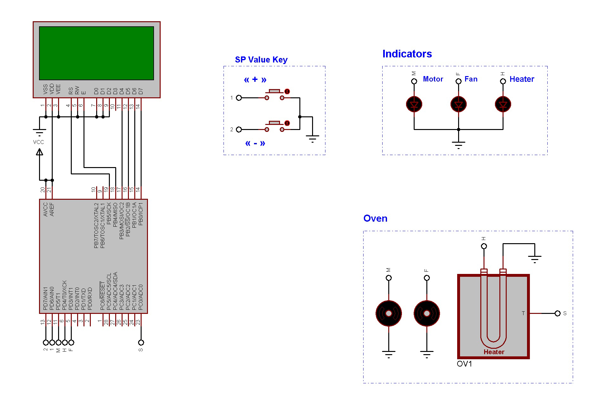

# AVR PID Temperature Controller

 

### This repository is PID Temperature Controller .

As the name implies, a temperature controller - often called a PID controller is an instrument used to control temperature. The temperature controller takes an input from a temperature sensor and has an output that is connected to a control element such as a heater or fan.
To accurately control process temperature without extensive operator involvement, a temperature control system relies upon a controller, which accepts a temperature sensor such as a thermocouple or RTD as input. It compares the actual temperature to the desired control temperature, or setpoint, and provides an output to a control element. In this case, there are 2 keys to set the Set Point and 3 outputs for the heater, fan and motor . 

###### This repository contains Source Files & Proteus Circuit Simulation Files. 

---

 
